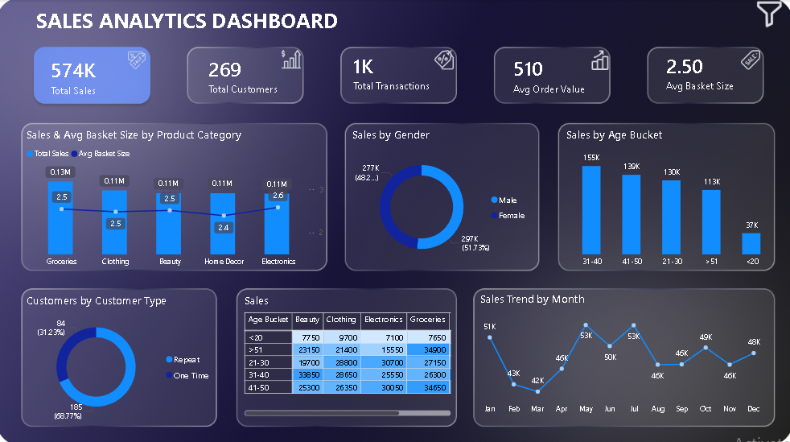
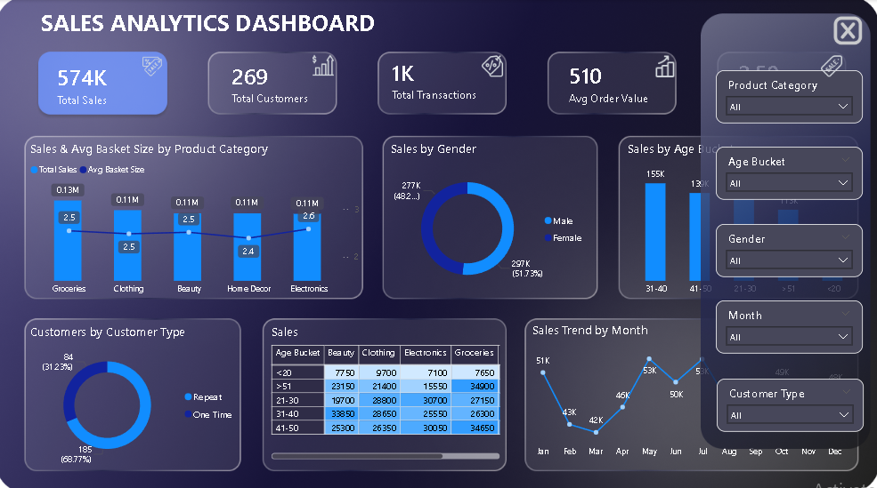

# 📊 Sales Analytics Dashboard

## Project Overview
This Power BI Sales Analytics Dashboard provides insights into sales performance, customer behavior, product categories, and monthly trends.

## Key Features
- Total Sales Analysis
- Customer Analysis
- Transaction Analysis
- Average Order Value (AOV)
- Product Category Performance
- Sales by Gender
- Sales by Age Group
- Monthly Sales Trends
- Interactive Filters and Slicers

## Tools Used
- Power BI
- Power Query
- DAX
- Excel

## Dashboard Preview

## Files Included
- Sales_Analytics_Dashboard_1.pbix
- Sales_Analytics_Dashboard.mp4
- Dashboard Screenshots

## Skills Demonstrated
- Data Cleaning
- Data Modeling
- DAX Calculations
- Dashboard Design
- Business Intelligence
- Data Visualization
